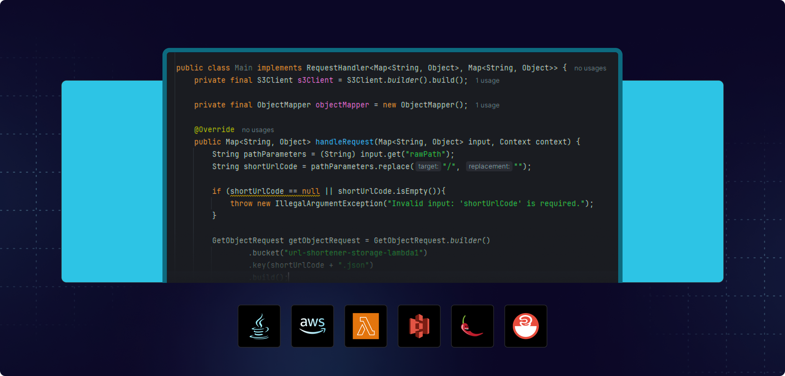

 
  
&#xa0;

<h1 align="center">Encurtador de URL</h1>

 

## :dart: Sobre

Um serviço de encurtamento de URL sem servidor criado com a AWS, usando Lambda, API Gateway e S3. Este projeto mostra como criar aplicativos escalonáveis e econômicos com tecnologias nativas da nuvem. Desenvolvido durante um evento gratuito da Rocketseat, proporcionando experiência prática em arquitetura serverless.

## :rocket: Tecnologias

As seguintes ferramentas foram utilizadas neste projeto:

- Java
- AWS
- Lambdas
- S3

Feito com :heart: por <a href="https://github.com/pkcosta843" target="_blank">Patrick Costa</a>

&#xa0;

<a href="#top">Voltar ao topo</a>
